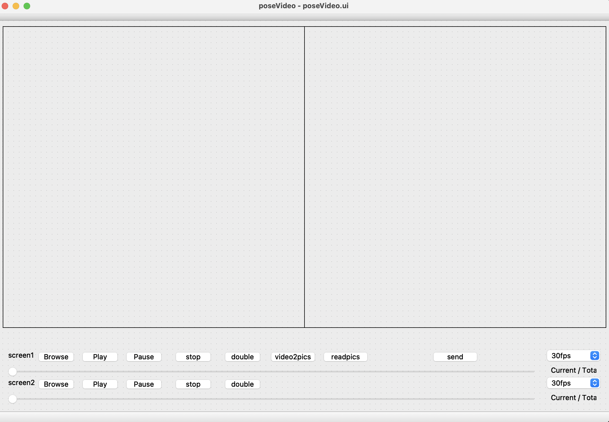

# Pedestrian ReID Video Player

#### This is a Pedestrian ReID Video Player

#### The video player was built with PyQT QTGui OpenCV

#### The Algorithm and Model were built with YOLOV3

### The Video_Player_UI as follows

### UI Function

As shown, the UI includes several video player functions, which includes several buttons as follows:

1. Browse
2. Play
3. Pause
4. Stop
5. Double (Speed)
6. Video2pics
7. Send
8. FPS_Control_pannel
9. Progress Bar

### The final result as follows

